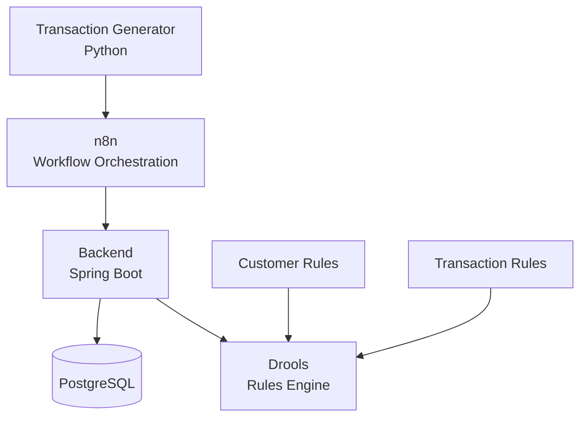

# AML Transaction Monitoring System

**Project State: IN_PROGRESS**

An AI-assisted **Anti-Money Laundering (AML) Transaction Monitoring System** designed to generate synthetic financial transactions, evaluate them against customer and transaction rules, and identify potentially fraudulent activity.

The project is being developed as a learning and portfolio project, with an emphasis on:

* Microservices
* Event/workflow processing
* Business rules
* Fraud detection
* AML transaction monitoring
* Docker
* Kubernetes readiness
* Automation
* AI-assisted processing

---

# Architecture

The system is divided into several independent components.




---

# Components

## transaction-generator

A Python application responsible for generating synthetic financial transactions.

The generator will support:

* Good transactions
* Transactions containing intentionally generated fraudulent activity
* Configurable number of records
* Configurable percentage of fraudulent records

Configuration is stored in:

```text
transaction-generator/config.yaml
```

Example:

```yaml
number_of_records: 20
record_type: RECORDS_WITH_FRAUD
fraud_percentage: 10
```

The generator is intended to provide repeatable test data for the transaction-monitoring system.

---

## backend

A Spring Boot microservice responsible for transaction processing.

The backend incorporates the **Drools rules engine**.

Its responsibilities include:

* Receiving transactions
* Validating transaction data
* Applying business rules
* Identifying transactions that require further investigation
* Recording processing results
* Communicating with the persistence layer

The backend is the main transaction-processing service.

---

## n8n

n8n provides the **workflow orchestration layer**.

It is responsible for coordinating the flow of transactions through the system.

The workflow will connect the various components and allow processing steps to be automated without putting all orchestration logic into the Spring Boot application.

---

## rules

Contains the business rules used by the transaction-monitoring system.

The rules will be separated into areas such as:

```text
rules/
├── customer-rules/
└── transaction-rules/
```

### Customer rules

Rules relating to customer behaviour and customer-specific AML conditions.

### Transaction rules

Rules relating to individual transactions and transaction patterns.

The rules are evaluated by the Drools rules engine running within the backend.

---

## PostgreSQL

PostgreSQL provides persistent storage for the system.

It will be used for data such as:

* Customers
* Transactions
* Transaction-processing results
* Fraud/AML alerts
* Rule evaluation results

PostgreSQL is deployed as a separate Docker container.

---

# Docker

Docker Compose configurations are maintained under:

```text
docker-compose/
```

Current containers:

```text
docker-compose/
├── postgres/
│   ├── .env
│   ├── compose.yaml
│   └── README.md
│
└── n8n/
    ├── .env
    ├── compose.yaml
    └── README.md
```

Additional containers planned for the project:

```text
docker-compose/
├── postgres/
├── n8n/
├── transaction-generator/
└── transaction-monitor/
```

The Docker Compose directories are kept separate so that each container can be configured and managed independently.

---

# Transaction Flow

The planned transaction flow is:

```text
1. Transaction Generator
          │
          ▼
2. n8n Workflow
          │
          ▼
3. Spring Boot Backend
          │
          ▼
4. Drools Rules Engine
          │
          ├── Customer Rules
          │
          └── Transaction Rules
          │
          ▼
5. Processing Result
          │
          ▼
6. PostgreSQL
```

A future **transaction-monitor** component will provide additional monitoring functionality as the system develops.

---

# Technology Stack

Current and planned technologies include:

| Technology     | Purpose                        |
| -------------- | ------------------------------ |
| Python         | Transaction generation         |
| Java           | Backend transaction processing |
| Spring Boot    | Backend microservice           |
| Drools         | Business rules engine          |
| n8n            | Workflow orchestration         |
| PostgreSQL     | Persistent storage             |
| Docker         | Containerization               |
| Docker Compose | Local/container deployment     |

Additional technologies may be introduced as the architecture evolves.

---

# Project Goals

The project is intended to demonstrate the design and implementation of a realistic AML transaction-monitoring platform.

Key goals include:

* Generate realistic synthetic financial transactions
* Generate controlled fraudulent activity for testing
* Process transactions through an automated workflow
* Apply configurable AML/fraud business rules
* Persist transaction and monitoring information
* Identify transactions requiring investigation
* Demonstrate microservice architecture
* Demonstrate containerized deployment
* Provide a foundation for future AI-assisted fraud analysis

---

# Project Status

**IN_PROGRESS**

The architecture and components are being developed incrementally.

Components will be implemented and integrated one at a time, with the architecture allowed to evolve as requirements become clearer.

The initial priority is establishing the transaction generation, PostgreSQL, n8n, Spring Boot/Drools processing, and rules components before adding the planned transaction-monitor service.
